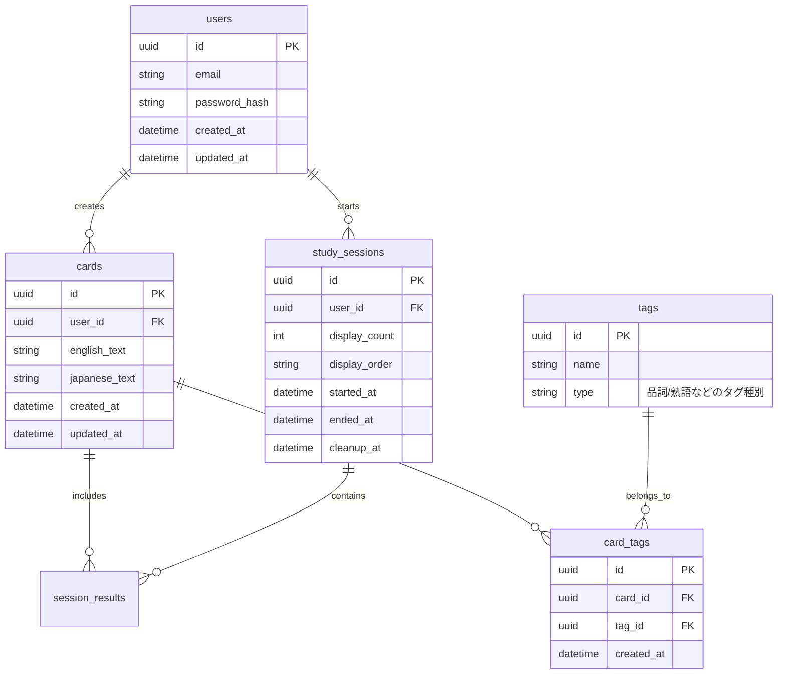

# フラッシュカードアプリ

## API設計

### タグ関連
#### `GET /api/tags`
- **Query Parameters**: 
  - `type` (オプション): タグの種類でフィルタリング
- **レスポンス**:
  ```json
  {
    "items": [
      {
        "id": "string",
        "name": "string",
        "type": "string"
      }
    ]
  }
  ```

#### `POST /api/tags`
- **リクエスト**:
  ```json
  {
    "name": "string",
    "type": "string"
  }
  ```
- **レスポンス**: タグオブジェクト (TagDto)

### カード関連
#### `POST /api/cards`
- **リクエスト**:
  ```json
  {
    "english_text": "string",
    "japanese_text": "string",
    "tag_ids": ["string"]
  }
  ```
- **レスポンス**: カードオブジェクト (CardDto)

### 学習セッション
#### `POST /api/study-sessions`
- **リクエスト**:
  ```json
  {
    "display_count": number,
    "tag_ids": ["string"]
  }
  ```
- **レスポンス**:
  ```json
  {
    "session_id": "string",
    "cards": [CardDto]
  }
  ```

### CSV一括登録
#### `POST /api/cards/upload`
- **リクエスト**: FormData (CSVファイル)
  - 必須列: `english_text`, `japanese_text`, `tags`
- **レスポンス**:
  ```json
  {
    "success": boolean,
    "created": number,
    "errors": ["string"]
  }
  ```

## データベース設計

### ER図


## インフラ構成

### アーキテクチャ
1. **フロントエンド**: Next.js
   - ホスティング: Vercel
   - メリット: 無料枠で十分な機能

2. **バックエンド**: Nest.js
   - ホスティング: Render
   - メリット: 
     - 無料枠あり
     - 簡単なCI/CD設定

3. **データベース**: PostgreSQL
   - ホスティング: Neon
   - メリット:
     - 無料枠: 3GiB
     - バックアップ機能
     - プールされた接続
     - Serverless対応

### 構成のメリット
- 各サービスの無料枠を最大限活用
- サービスごとに独立したスケーリング
- 開発/本番環境の簡単な分離
- 安定性の高いプラットフォーム

## 開発ワークフロー

### ローカル開発環境
1. Docker Composeを使用
   - バックエンド+DBの環境構築
   - フロントエンドは直接ローカル実行

### CI/CD
- GitHub Actionsによるテスト自動化
- 各プラットフォームへの自動デプロイ設定

## 推奨される開発環境
- Node.js: v18以降
- Docker
- PostgreSQL

## セットアップ手順
1. リポジトリをクローン
2. `docker-compose up -d`で開発環境を起動
3. 依存関係をインストール: `npm install`
4. 環境変数を設定
5. アプリケーションを起動: `npm run dev`

## テスト
- バックエンドテスト: `npm run test`
- フロントエンドテスト: `npm run test:frontend`

## デプロイ
各環境（Vercel, Render, Neon）の公式ドキュメントに従ってデプロイを行ってください。